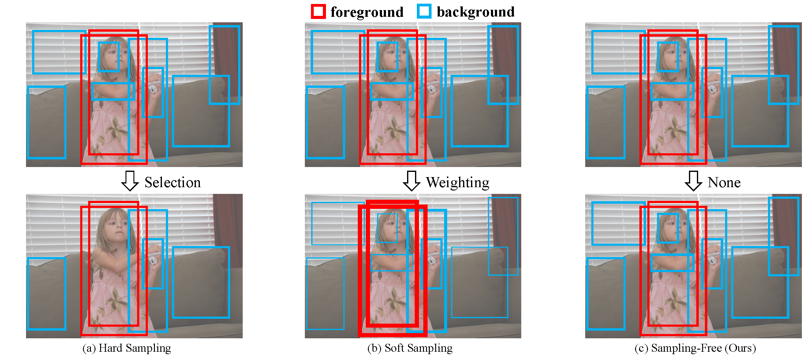
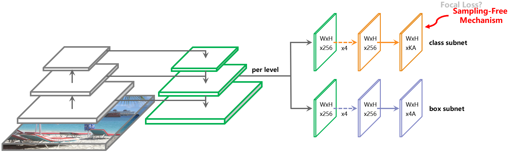

# Sampling-Free for Object Detection

*Development, Maintenance @ChenJoya*

**To address the foreground-background imbalance, is sampling heuristics necessary in training deep object detectors?** 

Keep clam and try the sampling-free mechanism in this repository. 

**Sampling-free mechanism enables various object detectors (e.g. one-stage, two-stage, anchor-free, multi-stage) to drop sampling heuristics (e.g., undersampling, Focal Loss, objectness), but achieve better bounding-box or instance segmentation accuracy.**




Technical report: https://arxiv.org/abs/1909.04868. This repository is based on [maskrcnn-benchmark](https://github.com/facebookresearch/maskrcnn-benchmark), including the implementation of RetinaNet, Faster/Mask R-CNN. Other detectors will also be released.

## Installation

Check [INSTALL.md](INSTALL.md) for installation instructions.

Check [datasets/README.md](https://github.com/ChenJoya/sampling-free/blob/master/datasets/README.md) for preparing your datasets.

## Training
By setting ```sampling_free_on=True``` in [scripts/train.sh](https://github.com/ChenJoya/sampling-free/blob/master/scripts/train.sh), you can easily train with the sampling-free mechanism.

### An example of training

We give an example of training Faster R-CNN with the sampling-free mechanism on COCO, using 4 GPUs.

1. Modifying the [scripts/train.sh](https://github.com/ChenJoya/sampling-free/blob/master/scripts/train.sh)：
```
det=faster_rcnn
backbone=R_50_FPN
schedule=0.2x

sampling_free_on=True
# 1.0 for retinanet, 2.0 for rcnn
classification_scale=2.0

gpus=0,1,2,3
gpun=4
master_addr=127.0.0.1
master_port=29501
```
2. Executing [scripts/train.sh](https://github.com/ChenJoya/sampling-free/blob/master/scripts/train.sh)：
```
./scripts/train.sh
```
3. Now the training is done. Your work dir is in ```backup/your_model_name/```, with every 5000 iterations saving a model.

## Evaluation
By modifying [scripts/eval.sh](https://github.com/ChenJoya/sampling-free/blob/master/scripts/eval.sh), you can easily evaluate your trained model.

### An example of evaluation
We give an example of evaluating trained model using 4 GPUs, with 16 images per GPU.

1. Modifying the [scripts/eval.sh](https://github.com/ChenJoya/sampling-free/blob/master/scripts/eval.sh):
```
model=faster_rcnn_voc_R_50_FPN_0.2x_freex2.0
network=faster_rcnn_voc_R_50_FPN

gpus=0,1,2,3
gpun=4
master_addr=127.0.0.8
master_port=29508

# suitable for 1080Ti (12G)
# change its value for your GPU
ims_per_batch=$[16*$gpun]
```

Here, ```network=faster_rcnn_voc_R_50_FPN``` refers to the model name without schedule.

2. Setting the iterations that you want to evaluate in [scripts/eval.sh](https://github.com/ChenJoya/sampling-free/blob/master/scripts/eval.sh):
```
for iter in "0060000" "0090000"：
  ......
```

3. Executing [scripts/eval.sh](https://github.com/ChenJoya/sampling-free/blob/master/scripts/eval.sh)：
```
./scripts/eval.sh
```

## Model Zoo and Baselines

Pre-trained models, trained baselines can be found in [MODEL_ZOO.md](MODEL_ZOO.md).

### COCO dataset

Model | Config | Box AP (minival) | Box AP (testdev) | Mask AP (minival) |
--- |:---:|:---:|:---:|:---:|
RetinaNet | retinanet_R_50_FPN_1x | 36.4 | 36.6 | -- |
**RetinaNet + Sampling-Free**<br>[download](https://drive.google.com/open?id=196qTrYNLmExr8iBzlpSLtcjy0tF4EjEE) | retinanet_R_50_FPN_1x | **36.6** | **36.8** | -- |
Faster R-CNN | faster_rcnn_R_50_FPN_1x | 36.8 | 37.2 | -- |
**Faster R-CNN + Sampling-Free**<br>[download](https://drive.google.com/open?id=1toMrZkxczj0mHMDONk2EnkA_iLyYuXvM) | faster_rcnn_R_50_FPN_1x | **38.4** | **38.6** | -- |
Mask R-CNN | mask_rcnn_R_50_FPN_1x | 37.8 | 38.0 | 34.2 |
**Mask R-CNN + Sampling-Free**<br>[download](https://drive.google.com/open?id=1PYlfbgHTDrEMCftErOloLTtpKFAsSnCx) | mask_rcnn_R_50_FPN_1x | **39.0** | **39.2** | **34.9** |
RetinaNet | retinanet_R_101_FPN_1x | 38.5 | 38.8 | -- |
**RetinaNet + Sampling-Free**<br>[download](https://drive.google.com/open?id=1z347IMUevG6wuYOTh-0-HDLvfXY1ouCE) | retinanet_R_101_FPN_1x | **38.8** | **39.0** | -- | 
Faster R-CNN | faster_rcnn_R_101_FPN_1x | 39.1 | 39.3 | -- |
**Faster R-CNN + Sampling-Free**<br>[download](https://drive.google.com/open?id=18s9OiWV3xe26EvbiEdy-8ApmurIi2bEm) | faster_rcnn_R_101_FPN_1x | **40.3** | **40.7** | -- | 

### PASCAL VOC dataset (07+12 for training)

Model | Config | mAP (07test) |
--- |:---:|:---:|
RetinaNet | retinanet_voc_R_50_FPN_0.2x | 79.3 |
**RetinaNet + Sampling-Free**<br>[download](https://drive.google.com/open?id=1Gd-2JIOWnKa1Z53wpCAwkqFO0r5BsOiP) | retinanet_voc_R_50_FPN_0.2x | **80.1** |
Faster R-CNN | faster_rcnn_voc_R_50_FPN_0.2x | 80.9 |
**Faster R-CNN + Sampling-Free**<br>[download](https://drive.google.com/open?id=1M4y_R76Cf7D1M57aQlgcV8AiE77Vnl59) | faster_rcnn_voc_R_50_FPN_0.2x | **81.5** |

## Other Details
See the original benchmark [maskrcnn-benchmark](https://github.com/facebookresearch/maskrcnn-benchmark) for more details.

## Citations
Please consider citing this project in your publications if it helps your research. The following is a BibTeX reference. The BibTeX entry requires the `url` LaTeX package.

```
@article{sampling_free,
author    = {Joya Chen and
             Dong Liu and
             Tong Xu and
             Shilong Zhang and
             Shiwei Wu and
             Bin Luo and
             Xuezheng Peng and
             Enhong Chen},
title     = {Is Sampling Heuristics Necessary in Training Deep Object Detectors?},
journal   = {CoRR},
volume    = {abs/1909.04868},
year      = {2019},
url       = {http://arxiv.org/abs/1909.04868},
archivePrefix = {arXiv},
eprint    = {1909.04868},
}
```

## License

**sampling-free** is released under the MIT license. See [LICENSE](https://github.com/ChenJoya/sampling-free/blob/master/LICENSE) for additional details.
